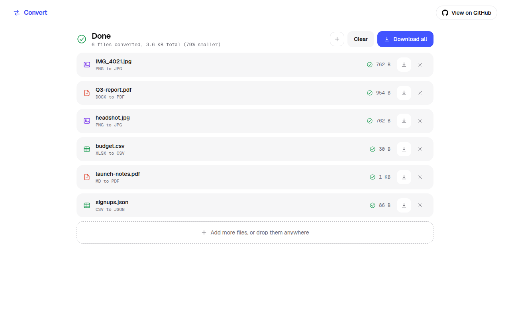
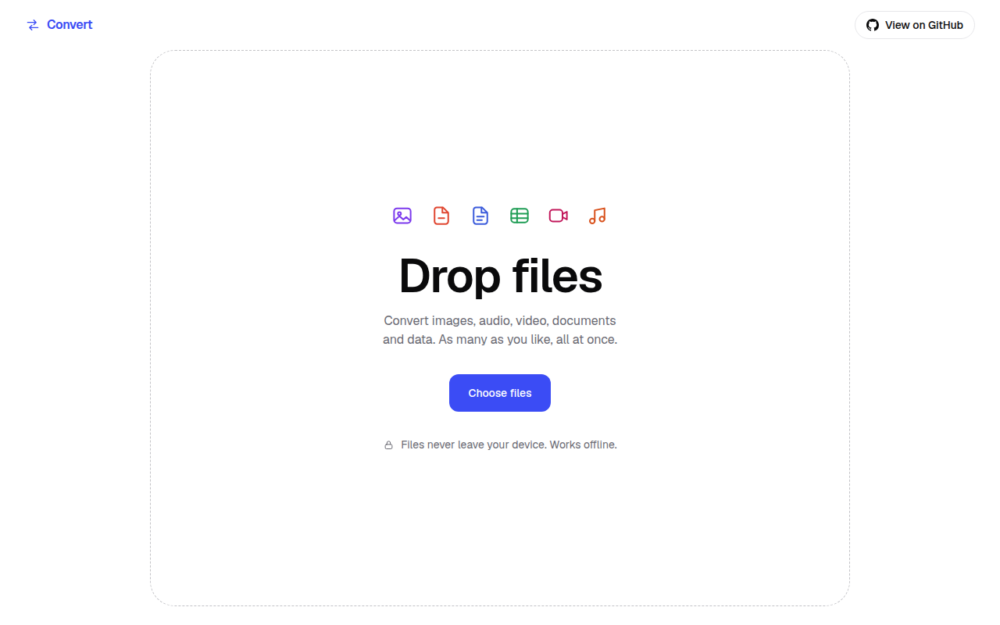
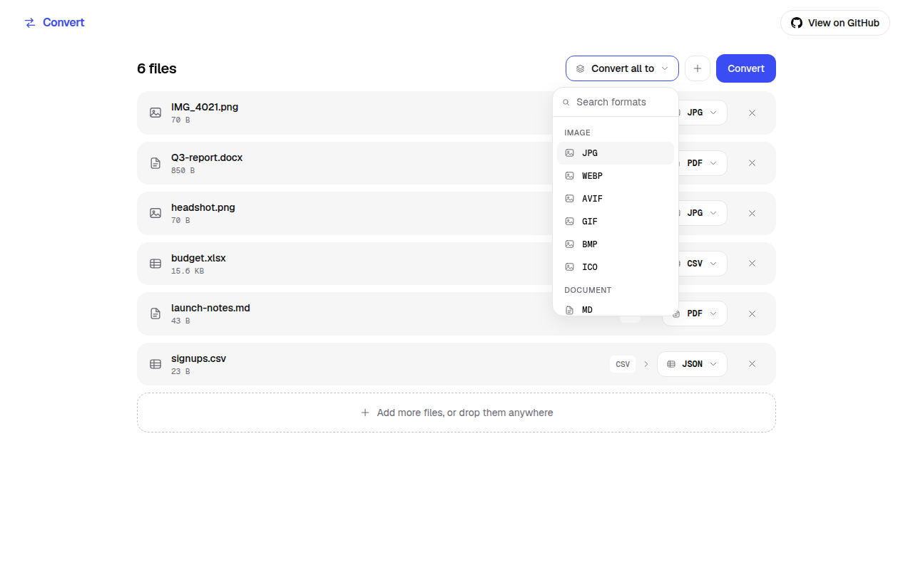
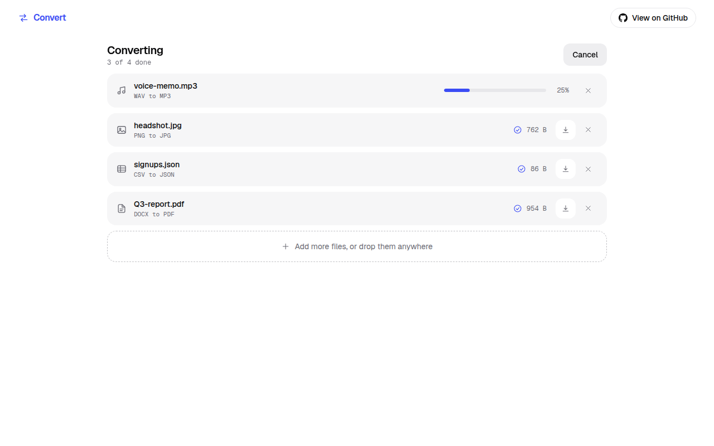
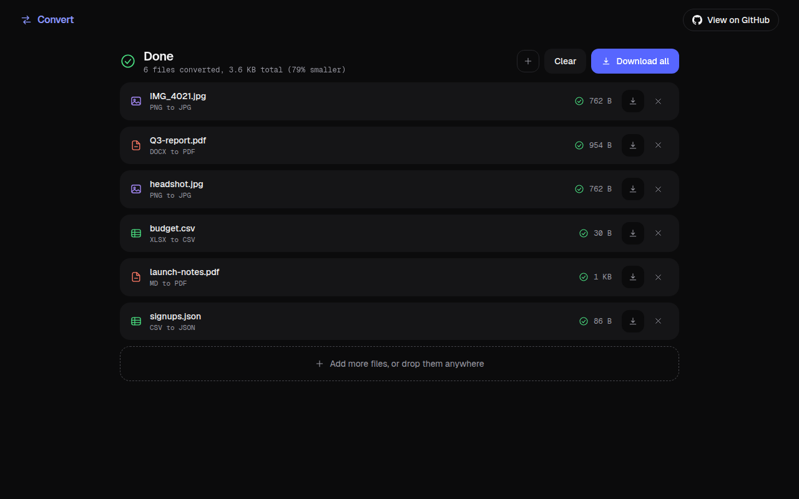
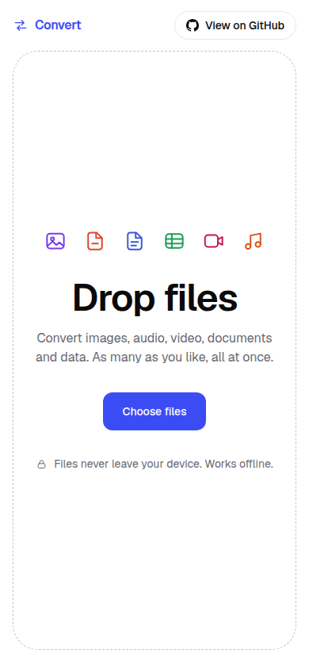
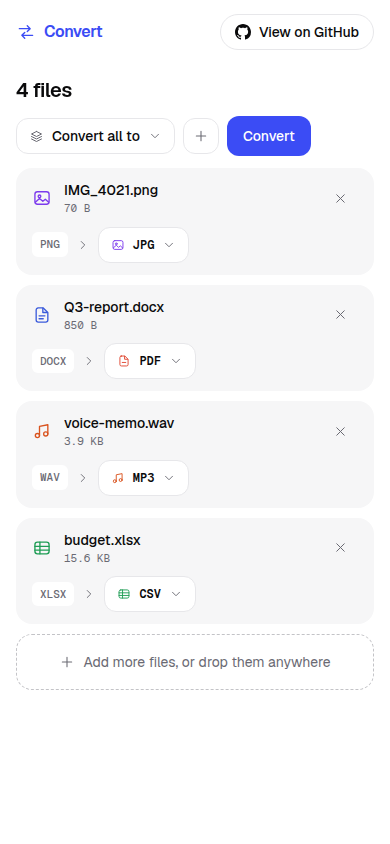

<p align="center">
  
</p>

<h1 align="center">Convert</h1>

<p align="center">
  A free, private file converter that runs entirely in your browser. Drop in files, pick a format, download the results.
  https://freeconvert.vercel.app
</p>

<p align="center">
  <a href="LICENSE"></a>
  <a href="https://nodejs.org"></a>
  <a href="#offline-and-installing"></a>
</p>

## Screenshots

<p align="center">
  
</p>

<table>
  <tr>
    <td width="50%" align="center">
      <br />
      <sub>Drop files anywhere, paste them, or choose them</sub>
    </td>
    <td width="50%" align="center">
      <br />
      <sub>One format for everything, or one per file</sub>
    </td>
  </tr>
  <tr>
    <td width="50%" align="center">
      <br />
      <sub>Each file has its own progress, cancel and download</sub>
    </td>
    <td width="50%" align="center">
      <br />
      <sub>Light and dark follow your system setting</sub>
    </td>
  </tr>
  <tr>
    <td width="50%" align="center">
      <br />
      <sub>Works at 390 px wide</sub>
    </td>
    <td width="50%" align="center">
      <br />
      <sub>Row controls wrap under the file name</sub>
    </td>
  </tr>
</table>

## What it does

Convert turns files from one format into another without sending them anywhere. There is no upload, no account and no server cost per conversion, so there is no size limit except what your device can handle.

- Drop any number of mixed files at once. Folders are flattened.
- Each file is identified by its content, not its name. A PNG called `holiday.heic` shows up as PNG.
- Pick one output format for the whole batch, or a different one per file. Files that cannot reach the chosen format keep their own choice and say why.
- Files convert in parallel. One failure never stops the others, and any file can be cancelled or retried.
- Download files one by one, or all at once as a zip with de-duplicated names (`photo.jpg`, `photo (1).jpg`).
- Works offline after the first visit. Nothing but static files ever crosses the network.

### Supported formats

| Kind | Reads | Writes | Engine |
| --- | --- | --- | --- |
| Images | PNG, JPG, WebP, AVIF, GIF, BMP, SVG, HEIC | PNG, JPG, WebP, AVIF, GIF, BMP, ICO | Canvas, plus WASM codecs (jSquash, heic-to) |
| Audio | MP3, WAV, FLAC, OGG, M4A, AAC | MP3, WAV, FLAC, OGG, M4A | ffmpeg.wasm |
| Video | MP4, MOV, WebM, MKV, AVI | MP4, WebM, GIF, MP3 (audio only) | ffmpeg.wasm |
| Documents | Markdown, HTML, TXT, DOCX | Markdown, HTML, TXT, PDF | marked, node-html-markdown, mammoth, pdf-lib |
| PDF | PDF | PNG or JPG (one image per page), TXT | pdf.js |
| Data | CSV, JSON, XLSX, YAML, XML | CSV, JSON, XLSX, YAML | PapaParse, SheetJS, js-yaml, fast-xml-parser |

A format a file cannot reach is simply not offered. A multi page PDF converted to images comes back as one zip.

## How it works

One page moves through four states: empty, queued, converting, done. The state is derived from the job list, so it can never disagree with what is on screen.

```
drop files
  detect type from the first 64 KB       (magic bytes, then MIME, then extension)
  choose output formats                  (reads the format registry)
  worker pool runs the jobs              (one engine per format family)
  results stay in memory or go to disk   (large ones use OPFS)
  download one file, or stream a zip
```

### The format registry

`src/features/formats` holds every format and every route as plain data. A route says "this engine can turn these inputs into these outputs". The UI never hardcodes a format, it asks the registry what a file can become. To add a format:

1. Add a line to `definitions.ts`.
2. List it in `routes.ts` under the engine that can handle it.
3. Teach that engine's converter about it.

No component changes.

### Workers and the pool

All conversion runs in Web Workers, talking to the page through Comlink. The pool has `hardwareConcurrency - 1` workers (at least 1, at most 4). A scheduler decides what starts next. Video is limited to one job at a time, because a decoded clip can fill a tab, and a waiting video never blocks the images behind it.

Cancelling a file terminates its worker. The browser frees the memory straight away and the next job gets a fresh worker. Engines are loaded with dynamic imports inside the worker, so none of them is part of the first page load.

### Detection

Detection reads the first 64 KB of a file. Binary formats are matched by signature. ISO media files (MP4, MOV, M4A, HEIC, AVIF) are told apart by their brand, RIFF files (WebP, WAV, AVI) by their form type, and DOCX and XLSX are told apart from a plain zip by the entry names. Text formats use strong content signals (an XML prolog, valid JSON) before falling back to the MIME type and the extension.

### Large files

Results above 256 MB are written to the Origin Private File System instead of staying in memory, and the downloaded file is read back from disk. Set `NEXT_PUBLIC_SPILL_THRESHOLD_MB` at build time to change the limit. ffmpeg reads its input straight from the `File` through WORKERFS, so a multi gigabyte video is not copied into memory first. Spilled files are deleted on Clear and on the next page load.

### ffmpeg

The ffmpeg core is copied from `node_modules` into `public/ffmpeg` at build time and served from your own origin, so no CDN is contacted. It is cached with the Cache API after the first use. The multi-threaded core is used when the page is cross-origin isolated (`next.config.ts` sets the two headers for that), and the single-threaded core is the fallback. While the 30 MB core loads, the row shows "Preparing converter".

### Offline and installing

A small service worker caches the app shell and the static build output. After the first visit the app warms the image, data, document and PDF engines in the background (skipped when Save-Data is on), so conversions with them work with no network. Audio and video work offline once you have converted one file, because that is when the ffmpeg core is cached. The app can be installed from the browser menu.

### Privacy

No file bytes, file names or metadata leave the device. There are no cookies and no third party scripts. An end to end test checks that a conversion makes no request to any other origin.

### Design

The interface is one full screen page with rounded corners and generous spacing. One blue accent carries every action: buttons, focus rings and progress bars. Everything else is black, white and soft grays.

Two small color sets sit beside the accent, both taken from the design mockups:

- **File type colors** tint only the file icons: purple for images, red for PDF, blue for documents, green for data, crimson for video and orange for audio.
- **Green** marks finished work.

The values are CSS variables in `src/app/globals.css`, with a lighter set for dark mode that follows the system setting. Icons are plain SVG on a shared 24 unit grid. The layout holds up at 390 px wide, and every control works from the keyboard.

## Project structure

```
assets/brand/            logo
docs/screenshots/        README images, regenerated by an e2e spec
e2e/                     Playwright tests and fixture builders
public/                  service worker and icons (ffmpeg and pdf.js files are copied in at build)
scripts/                 asset copying and icon generation
src/
  app/                   layout, page, manifest
  components/            icons and small UI primitives
  config/                site constants
  engines/               one folder per engine, each exports a converter function
    image/ ffmpeg/ document/ pdf/ data/
  features/
    formats/             format table, routes, registry, format picker
    detect/              content based type detection
    queue/               job store, pure job logic, file list
    conversion/          worker, pool, scheduler, controller, OPFS
    download/            zip streaming, name de-duplication, saving
    dropzone/            drag and drop, paste, file picker, empty state
    workspace/           the screen, top bar, action bars
    a11y/                screen reader announcements
    pwa/                 service worker registration
  lib/                   small shared helpers
```

## Getting started

You need Node 20 or newer.

```bash
npm install
npm run dev
```

Then open http://localhost:3000. For a production build:

```bash
npm run build
npm run start
```

`dev` and `build` first copy the ffmpeg and pdf.js files into `public/`. Both use webpack, because Turbopack stalls on this project's WASM heavy dependency graph.

| Script | What it does |
| --- | --- |
| `npm run dev` | Development server |
| `npm run build` | Production build |
| `npm run start` | Serve the production build |
| `npm run lint` | ESLint |
| `npm run typecheck` | TypeScript, no emit |
| `npm test` | Unit tests (Vitest) |
| `npm run e2e` | End to end tests in Chromium (Playwright) |

### Tests

Unit tests cover the registry, detection, every engine's pure logic, the scheduler, naming, zip writing and the OPFS spill. The e2e suite builds the app, then drives it in a real browser: mixed batches, every output family, cancel and retry, keyboard use, drag and drop, paste, offline mode and the network check.

```bash
npx playwright install chromium   # once
npm run e2e
```

Use `CHROMIUM_PATH=/path/to/chrome` to run with a browser you already have, and `PW_NO_SANDBOX=1` when running as root in a container. To regenerate the README screenshots, run `CAPTURE=1 npm run e2e -- screenshots`.

### Deploying

Deploy to Vercel or any Node host. Static export is not supported, because the cross-origin isolation headers need a server. Without those headers the app still works, using the single-threaded ffmpeg core.

## Known limits

- PDF output uses the built-in PDF fonts, so text outside Latin-1 becomes `?`. Layout is plain on purpose: headings, paragraphs, lists and code.
- Animated GIFs convert as their first frame.
- XLSX conversion reads cell values, not formulas or styles.
- Very large inputs can still exhaust browser memory. The row then says so and offers a retry.
- Zip input and per-file quality options are planned, not built yet.

## License

MIT. See [LICENSE](LICENSE).
